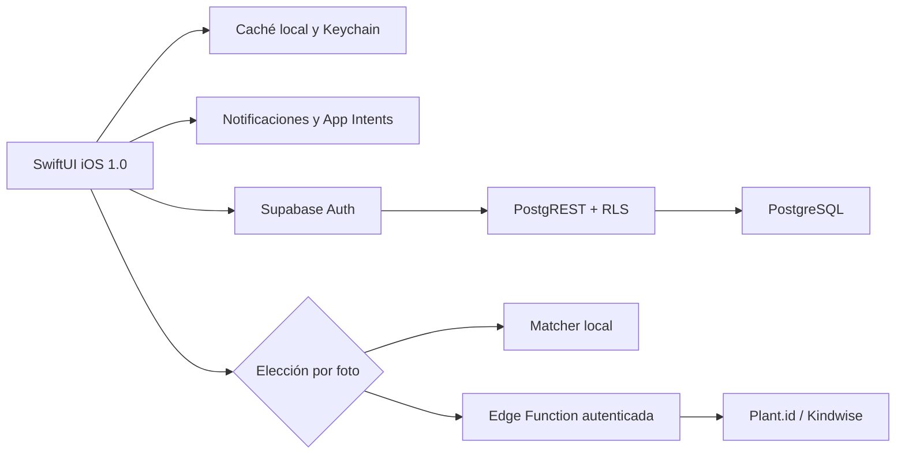

<div align="center">
  

# Rocío 1.0

**Cuidado de flores, claro y privado, en una app nativa para iPhone.**

Versión de marketing **1.0** · build **1** · iOS **17+** · Swift **5** · candidata beta en desarrollo

[](https://github.com/juliosuas/rocio/actions/workflows/qa.yml)
[](https://github.com/juliosuas/rocio/actions/workflows/ios.yml)
[](https://github.com/juliosuas/rocio/actions/workflows/ios-archive.yml)

[Sitio público](https://juliosuas.github.io/rocio/launch.html) · [Demo web local](https://juliosuas.github.io/rocio/index.html?demo=1) · [Privacidad](https://juliosuas.github.io/rocio/privacy.html) · [Soporte](https://juliosuas.github.io/rocio/support.html)
</div>

> [!IMPORTANT]
> El producto nativo está implementado y verificado localmente, pero todavía no está publicado en TestFlight ni en App Store. Faltan la membresía pagada de Apple, firma de distribución, configuración final de recuperación de cuenta y smoke tests físicos.

Rocío acompaña el ciclo que importa: elegir una flor, agregarla al jardín, entender el siguiente cuidado, activar un recordatorio de forma voluntaria y registrar el primer riego. La app iOS está construida con SwiftUI. El sitio web conserva una demo interactiva local y nunca debe confundirse con el cliente nativo ni con una descarga de App Store.

## App iOS nativa: lo que ya funciona

- **Catálogo de 15 flores** con fotografía atribuida, nombre científico, dificultad y cuidados.
- **Primera planta a primer cuidado**: agregar, volver a Mi Jardín, activar recordatorio y confirmar riego.
- **Jardín resiliente** con caché local, reintentos, estados de sincronización honestos y separación por cuenta.
- **Calendario de siete días** y notificaciones locales solicitadas únicamente después de una acción explícita.
- **Scanner experimental con privacidad por foto**: análisis en el iPhone o consentimiento nuevo antes de enviar una copia reducida a Plant.id/Kindwise mediante Supabase.
- **Recuperación de contraseña PKCE** sin tokens bearer en la URL, verifier en Keychain y protección contra carreras entre escenas.
- **Controles de datos** para exportar, borrar el jardín, desactivar analítica y eliminar permanentemente la cuenta.
- **English + Español**, App Intents y rutas nativas para jardín, scanner y riego.
- **Modo demo solo en Debug** para recorrer la UI sin Supabase ni contaminar datos reales.

## Demo web/PWA: una superficie separada

`index.html` es una demo sin framework y no forma parte del binario iOS. Incluye el catálogo de 15 flores, jardín e historial en `localStorage`, registro de riegos, calendario semanal y lunar, 36 tips estacionales, Plant Doctor, compostaje, calculadora de agua, tema oscuro y scanner local con candidatos e incertidumbre. También permite exportar o borrar los datos del navegador.

Su configuración cloud está deliberadamente vacía. La versión publicada no crea cuentas, no sincroniza con Supabase y no envía imágenes a Plant.id. Las notificaciones web dependen de los permisos y límites del navegador.

## Estado real

| Superficie | Estado | Qué significa |
|---|---|---|
| Demo web | Disponible | Guarda datos únicamente en este navegador y usa el matcher local. |
| App iOS 1.0 (build 1) | Candidata beta | Compila en Debug y Release; 115/115 pruebas pasan en iPhone 17 con iOS 26.3.1. |
| Supabase | Base verificada | Auth, RLS, ACL, cuota, sincronización y borrado están probados; la migración nueva aún no se despliega. |
| iPhone físico | Launch verificado | Abre con Personal Team; faltan cámara, fotos, notificaciones y scanner autenticado de punta a punta. |
| TestFlight / App Store | Bloqueado externamente | Requiere Apple Developer Program pagado, `DEVELOPMENT_TEAM`, firma y App Store Connect. |

## Límites conocidos

- El scanner y el contenido de cuidado son orientativos; no sustituyen un diagnóstico botánico o profesional.
- Las fichas locales cubren exactamente 15 flores. Un candidato externo puede no tener una ficha equivalente.
- El contenido de enfermedades y tratamientos de la demo web todavía requiere revisión botánica antes de presentarse como recomendación validada.
- La migración `20260721000100_preserve_garden_deletions.sql` está verificada en PostgreSQL 16 desechable, pero aún no se despliega al proyecto remoto.
- El cliente PKCE está implementado; faltan Site URL HTTPS, allowlist, SMTP y la prueba real correo → app → contraseña nueva.
- Faltan smoke tests productivos con dos sesiones y pruebas físicas completas de cámara, fotos y entrega de notificaciones.
- El icono pasa los controles automatizados; faltan screenshots finales y revisión visual para App Store.

## Arquitectura



La publishable key de Supabase es configuración pública del cliente. `SUPABASE_SERVICE_ROLE_KEY` y `PLANT_ID_API_KEY` viven exclusivamente en el servidor. La función Edge valida primero la sesión y no guarda la imagen original en PostgreSQL.

## Ejecutar la app iOS

### Requisitos

- macOS 15.7.4 o compatible.
- Xcode 26.3 seleccionado.
- Un runtime de iOS Simulator disponible.
- La publishable key de Supabase solo si quieres probar cloud; Debug puede usar el demo local sin ella.

### Configuración pública de Supabase

```sh
cp ios/Config/Local.xcconfig.example ios/Config/Local.xcconfig
```

Edita `ios/Config/Local.xcconfig` y agrega únicamente la `sb_publishable_...` del proyecto. El archivo está ignorado por Git. Nunca coloques ahí una `sb_secret_...`, un JWT `service_role` ni `PLANT_ID_API_KEY`.

### Build y pruebas

```sh
sudo xcode-select -s /Applications/Xcode.app/Contents/Developer
xcodebuild -project ios/Rocio.xcodeproj -scheme Rocio \
  -destination 'platform=iOS Simulator,name=iPhone 17' build
xcodebuild -project ios/Rocio.xcodeproj -scheme Rocio \
  -destination 'platform=iOS Simulator,name=iPhone 17' test
```

El detalle operativo del cliente nativo está en [`ios/README.md`](ios/README.md).

## Ejecutar el sitio y la demo web

```sh
python3 -m http.server 8000
```

- Presentación: <http://localhost:8000/launch.html>
- Demo con jardín de ejemplo: <http://localhost:8000/index.html?demo=1>
- Privacidad: <http://localhost:8000/privacy.html>
- Soporte: <http://localhost:8000/support.html>

La demo web es una superficie local separada: no crea cuentas, no sincroniza con Supabase y no envía fotos a Plant.id. Sirve para explorar el catálogo y los conceptos del producto mientras el binario iOS avanza a TestFlight.

## QA verificado

```sh
node qa/release-gate.mjs
node qa/cloud-ai-security-audit.mjs
node qa/ios-app-store-readiness-audit.mjs
ROCIO_SECURITY_DATABASE_URL='<postgres-16-desechable>' \
  node qa/run-cloud-ai-security-postgres.mjs
```

Evidencia local del 22 de julio de 2026:

- **115/115 XCTest** en iPhone 17, iOS 26.3.1.
- **Release unsigned** compilado con Xcode 26.3.
- **Release gate 11/11**.
- **Cloud/security 41/41**.
- **App Store audit 20/20**, `unsignedReady=true`.
- **PostgreSQL 16**: migraciones ordenadas, upgrade fixture, RLS, ACL, cuota, tombstones, reset y purge con rollback.

`signedReady=false` sigue siendo correcto mientras no exista un equipo de distribución configurado.

Los workflows reales son:

- `.github/workflows/qa.yml`: release gate y migraciones sobre PostgreSQL 16.
- `.github/workflows/ios.yml`: build y XCTest en Simulator.
- `.github/workflows/ios-archive.yml`: Archive Release unsigned y validación de configuración.

El repositorio no contiene un workflow que despliegue GitHub Pages; los cambios del sitio quedan visibles cuando llegan a la fuente configurada de Pages.

## Estructura del repositorio

```text
ios/                  App SwiftUI, recursos y XCTest
supabase/             Migraciones y Edge Functions
qa/                   Gates de producto, seguridad y App Store
assets/               Fotografías atribuidas y materiales del sitio
index.html            Demo web local
launch.html           Sitio público de la versión actual
privacy.html          Política pública de privacidad
support.html          Centro público de soporte
```

## Ruta a distribución

1. Integrar la cadena de PR en orden y repetir CI desde `main`.
2. Ejecutar `supabase db push --linked --dry-run` y aplicar la migración pendiente una sola vez.
3. Configurar Site URL HTTPS, redirect allowlist exacta y SMTP; probar correo → PKCE → contraseña nueva → login.
4. Completar smoke físico de cámara, fotos, notificaciones y dos sesiones sincronizadas.
5. Activar Apple Developer Program, configurar `DEVELOPMENT_TEAM`, firmar Archive y subir a TestFlight.
6. Capturar screenshots finales y completar App Store Connect.

El plan vivo está en [`APP_STORE_LAUNCH_PLAN.md`](APP_STORE_LAUNCH_PLAN.md) y el checklist de release en [`APP_STORE_RELEASE_CHECKLIST.md`](APP_STORE_RELEASE_CHECKLIST.md).

## Documentación útil

- [`DESIGN.md`](DESIGN.md) — sistema visual y reglas de interfaz.
- [`APP_STORE_METADATA.md`](APP_STORE_METADATA.md) — copy de App Store.
- [`APP_STORE_PRIVACY_ANSWERS.md`](APP_STORE_PRIVACY_ANSWERS.md) — declaraciones de privacidad.
- [`APPLE_DEVELOPER_RUNBOOK.md`](APPLE_DEVELOPER_RUNBOOK.md) — firma y distribución.
- [`PHOTO_ATTRIBUTIONS.md`](PHOTO_ATTRIBUTIONS.md) — fuentes y licencias de imágenes.
- [`SUPABASE_DIAGNOSTIC_2026-07-21.md`](SUPABASE_DIAGNOSTIC_2026-07-21.md) — diagnóstico cloud fechado.
- [`ROCIO_STATUS.md`](ROCIO_STATUS.md) — snapshot operativo actual.

## Soporte y reportes

Usa [GitHub Issues](https://github.com/juliosuas/rocio/issues/new) para errores o solicitudes. No publiques contraseñas, tokens, fotografías privadas ni datos personales en un issue.
