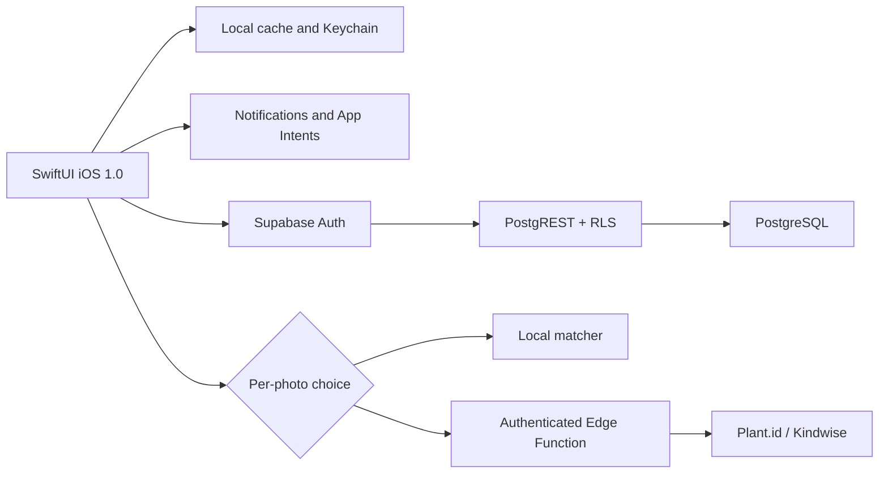

<div align="center">
  

# Rocío 1.0

**Clear, private plant care in a native iPhone app.**

Marketing version **1.0** · build **1** · iOS **17+** · Swift **5** · beta candidate in development

[](https://github.com/juliosuas/rocio/actions/workflows/qa.yml)
[](https://github.com/juliosuas/rocio/actions/workflows/ios.yml)
[](https://github.com/juliosuas/rocio/actions/workflows/ios-archive.yml)

[Public site](https://juliosuas.github.io/rocio/launch.html) · [Local-data web demo](https://juliosuas.github.io/rocio/index.html?demo=1) · [Privacy](https://juliosuas.github.io/rocio/privacy.html) · [Support](https://juliosuas.github.io/rocio/support.html)
</div>

> [!IMPORTANT]
> The native product is implemented and locally verified, but it is not yet available through TestFlight or the App Store. A paid Apple Developer membership, distribution signing, final account-recovery configuration, and physical-device smoke tests are still required.

Rocío supports the care cycle that matters: choose a plant, add it to the garden, understand the next care step, opt in to a reminder, and record the first watering. The current beta ships 15 editorial flower guides; the [12-hour production plan](GSTACK_APP_STORE_DAILY_PLAN.md) removes that runtime ceiling so scanned or manually entered plants can be saved, scheduled, used offline, synchronized, and rendered throughout the app. The iOS client is built with SwiftUI. The website hosts a separate interactive demo that stores its data locally; it is not the native client or an App Store download.

## Real iOS build

These are raw, privacy-safe screenshots captured on July 22, 2026 from the running Rocío Debug build on an iPhone 17 simulator with iOS 26.3. They are not mockups. Final App Store screenshots will be re-captured from the exact Release archive.

<p align="center">
  
  
  
  
  
</p>

## Native iOS app: what works today

- **Catalog of exactly 15 flowers** with attributed photography, scientific names, difficulty, and care guidance.
- **First plant to first care**: add a plant, return to My Garden, enable a reminder, and confirm watering.
- **Resilient garden** with a local cache, retries, honest sync states, and account isolation.
- **Seven-day calendar** and local notifications requested only after an explicit user action.
- **Experimental scanner with per-photo privacy**: analyze on the iPhone, or grant fresh consent before a reduced copy is sent to Plant.id/Kindwise through Supabase.
- **PKCE password recovery** without bearer tokens in URLs, with the verifier stored in Keychain and protection against cross-scene races.
- **Data controls** to export data, clear the garden, opt out of analytics, and permanently delete the account.
- **English + Spanish**, App Intents, and native routes for the garden, scanner, and watering.
- **Debug-only demo mode** for exploring the complete UI without Supabase or real account data.

## Web/PWA demo: a separate surface

`index.html` is a framework-free demo and is not part of the iOS binary. It includes the 15-flower catalog, a garden and scan history in `localStorage`, watering records, a weekly and lunar calendar, 36 seasonal tips, Plant Doctor, composting, a watering calculator, dark mode, and a local scanner that shows candidates and uncertainty. It also lets people export or erase browser data.

Its cloud configuration is intentionally blank. The published demo does not create accounts, sync with Supabase, or send images to Plant.id. Web notifications remain subject to browser permission and execution limits.

## Current status

| Surface | Status | What it means |
|---|---|---|
| Web demo | Available | Stores data only in the current browser and uses the local matcher. |
| iOS app 1.0 (build 1) | Beta candidate | Debug and Release compile; 115/115 tests pass on iPhone 17 with iOS 26.3.1. |
| Supabase | Foundation verified | Auth, RLS, ACLs, quota, sync, and deletion are tested; the new migration is not deployed yet. |
| Physical iPhone | Launch verified | Opens with a Personal Team; camera, photos, notifications, and the authenticated scanner still need end-to-end testing. |
| TestFlight / App Store | Externally blocked | Requires paid Apple Developer membership, `DEVELOPMENT_TEAM`, distribution signing, and App Store Connect. |

## Known limitations

- The scanner and care content are assistive. They do not replace a botanical or professional diagnosis.
- Local care records cover exactly 15 flowers. An external candidate may not have a matching local record.
- Disease and treatment content in the web demo still requires botanical review before it can be presented as validated guidance.
- Migration `20260721000100_preserve_garden_deletions.sql` is verified against disposable PostgreSQL 16, but has not been deployed to the remote project.
- The PKCE client is implemented. A stable HTTPS Site URL, redirect allowlist, custom SMTP, and a real email → app → new-password test are still required.
- Production smoke tests with two sessions and complete physical-device tests for camera, photos, and notification delivery remain outstanding.
- The icon passes automated checks; final screenshots and App Store visual review are still pending.

## Architecture



The Supabase publishable key is public client configuration. `SUPABASE_SERVICE_ROLE_KEY` and `PLANT_ID_API_KEY` must remain server-side. The Edge Function validates the session first and does not store the original image in PostgreSQL.

## Run the iOS app

### Requirements

- macOS 15.7.4 or another version compatible with Xcode 26.3.
- Xcode 26.3 selected as the active developer directory.
- An installed iOS Simulator runtime.
- The Supabase publishable key only when testing cloud behavior; Debug can use the local demo without it.

### Public Supabase configuration

```sh
cp ios/Config/Local.xcconfig.example ios/Config/Local.xcconfig
```

Edit `ios/Config/Local.xcconfig` and add only the project's `sb_publishable_...` key. The file is ignored by Git. Never place an `sb_secret_...` key, a `service_role` JWT, or `PLANT_ID_API_KEY` there.

### Build and test

```sh
sudo xcode-select -s /Applications/Xcode.app/Contents/Developer
xcodebuild -project ios/Rocio.xcodeproj -scheme Rocio \
  -destination 'platform=iOS Simulator,name=iPhone 17' build
xcodebuild -project ios/Rocio.xcodeproj -scheme Rocio \
  -destination 'platform=iOS Simulator,name=iPhone 17' test
```

See [`ios/README.md`](ios/README.md) for native-client operating details.

## Run the public site and web demo

```sh
python3 -m http.server 8000
```

- Product page: <http://localhost:8000/launch.html>
- Demo with sample garden: <http://localhost:8000/index.html?demo=1>
- Privacy: <http://localhost:8000/privacy.html>
- Support: <http://localhost:8000/support.html>

The web demo is a separate, local-data surface: it does not create accounts, sync with Supabase, or send photos to Plant.id. It provides a safe way to explore the catalog and product concepts while the iOS binary advances toward TestFlight.

## Verified QA

```sh
node qa/release-gate.mjs
node qa/cloud-ai-security-audit.mjs
node qa/ios-app-store-readiness-audit.mjs
ROCIO_SECURITY_DATABASE_URL='<disposable-postgres-16>' \
  node qa/run-cloud-ai-security-postgres.mjs
```

Local evidence from July 22, 2026:

- **115/115 XCTest cases** on iPhone 17 with iOS 26.3.1.
- **Unsigned Release** compiled with Xcode 26.3.
- **Release gate: 11/11**.
- **Cloud/security: 41/41**.
- **App Store audit: 20/20**, with `unsignedReady=true`.
- **PostgreSQL 16**: ordered migrations, upgrade fixture, RLS, ACLs, quota, tombstones, reset, and purge verified with rollback.

`signedReady=false` remains correct until a distribution team is configured.

The repository's actual workflows are:

- `.github/workflows/qa.yml`: release gate and migrations against PostgreSQL 16.
- `.github/workflows/ios.yml`: Simulator build and XCTest.
- `.github/workflows/ios-archive.yml`: unsigned Release archive and configuration validation.

The repository does not contain a GitHub Pages deployment workflow. Site changes become public when they reach the source configured for Pages.

## Repository structure

```text
ios/                  SwiftUI app, resources, and XCTest
supabase/             Migrations and Edge Functions
qa/                   Product, security, and App Store gates
assets/               Attributed photography and site media
docs/screenshots/ios/ Real screenshots from the running native app
index.html            Local-data web demo
launch.html           Public page for the current release
privacy.html          Public privacy policy
support.html          Public support center
```

## Path to distribution

1. Integrate the pull-request chain in order and rerun CI from `main`.
2. Run `supabase db push --linked --dry-run`, then apply the pending migration exactly once.
3. Configure the HTTPS Site URL, exact redirect allowlist, and SMTP; test email → PKCE → new password → login.
4. Complete physical-device smoke tests for camera, photos, notifications, and two synchronized sessions.
5. Activate the Apple Developer Program, configure `DEVELOPMENT_TEAM`, sign the archive, and upload it to TestFlight.
6. Capture final screenshots and complete App Store Connect.

The immediate arbitrary-plant execution order is in [`GSTACK_APP_STORE_DAILY_PLAN.md`](GSTACK_APP_STORE_DAILY_PLAN.md). The broader launch plan is in [`APP_STORE_LAUNCH_PLAN.md`](APP_STORE_LAUNCH_PLAN.md), and the release checklist is in [`APP_STORE_RELEASE_CHECKLIST.md`](APP_STORE_RELEASE_CHECKLIST.md).

## Useful documentation

- [`DESIGN.md`](DESIGN.md) — visual system and interface rules.
- [`APP_STORE_METADATA.md`](APP_STORE_METADATA.md) — App Store copy.
- [`APP_STORE_PRIVACY_ANSWERS.md`](APP_STORE_PRIVACY_ANSWERS.md) — privacy declarations.
- [`APPLE_DEVELOPER_RUNBOOK.md`](APPLE_DEVELOPER_RUNBOOK.md) — signing and distribution.
- [`PHOTO_ATTRIBUTIONS.md`](PHOTO_ATTRIBUTIONS.md) — image sources and licenses.
- [`SUPABASE_DIAGNOSTIC_2026-07-21.md`](SUPABASE_DIAGNOSTIC_2026-07-21.md) — dated cloud diagnosis.
- [`ROCIO_STATUS.md`](ROCIO_STATUS.md) — current operational snapshot.

## Support and reports

Use [GitHub Issues](https://github.com/juliosuas/rocio/issues/new) for bugs or requests. Do not post passwords, tokens, private photographs, or personal information in an issue.
