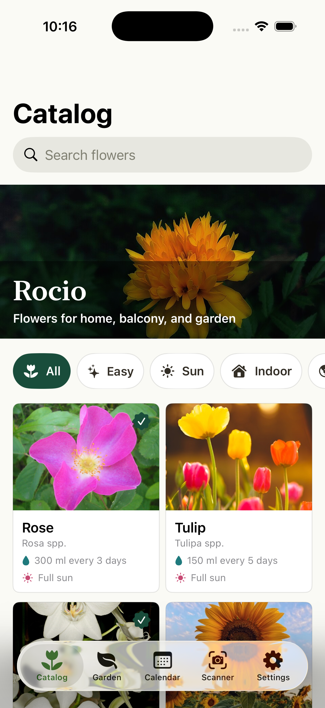
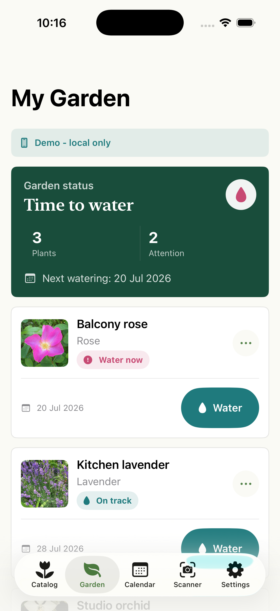
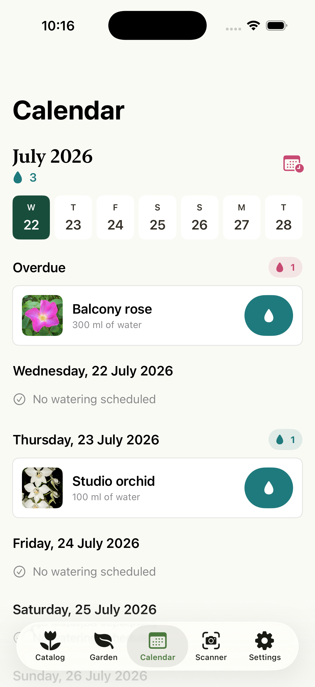
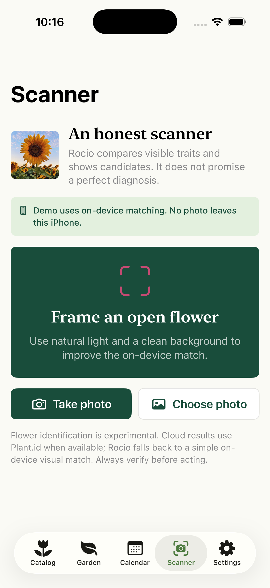
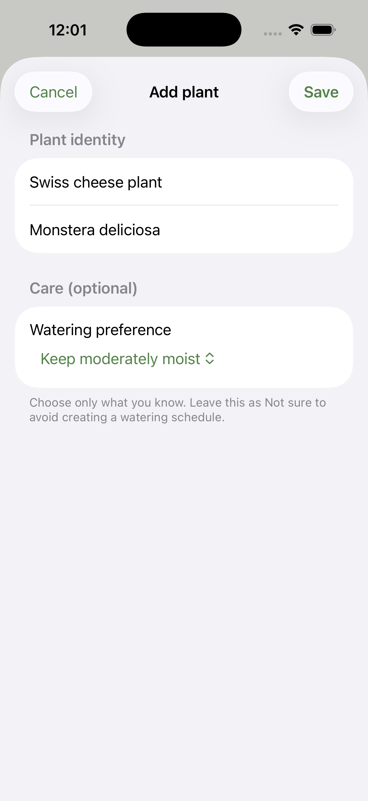
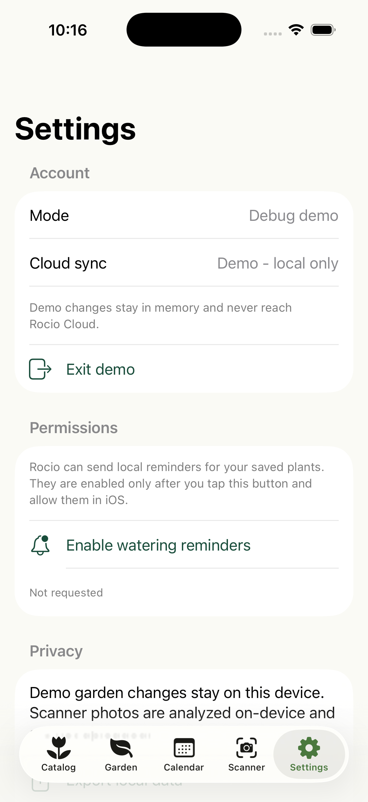
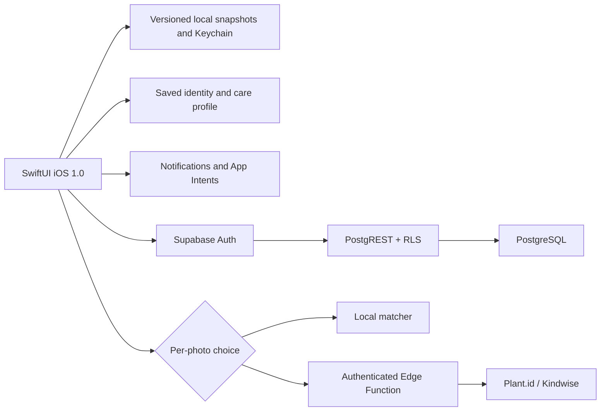

<div align="center">
  

# Rocío 1.0

**Clear, private plant care in a native iPhone app.**

Marketing version **1.0** · build **1** · iOS **17+** · Swift **5** · feature candidate in development

[](https://github.com/juliosuas/rocio/actions/workflows/qa.yml)
[](https://github.com/juliosuas/rocio/actions/workflows/ios.yml)
[](https://github.com/juliosuas/rocio/actions/workflows/ios-archive.yml)

[Public site](https://juliosuas.github.io/rocio/launch.html) · [Local-data web demo](https://juliosuas.github.io/rocio/index.html?demo=1) · [Privacy](https://juliosuas.github.io/rocio/privacy.html) · [Support](https://juliosuas.github.io/rocio/support.html)
</div>

> [!IMPORTANT]
> The arbitrary-plant implementation is locally verified on the feature branch, but its matching Supabase migrations and Edge Function update have not been deployed. Rocío is not yet available through TestFlight or the App Store. A paid Apple Developer membership, distribution signing, final account-recovery configuration, and physical-device smoke tests are still required.

Rocío supports the care cycle that matters: identify or enter a plant, save the individual specimen, choose an optional watering preference, receive an opt-in reminder, and record the first watering. The native runtime now supports arbitrary Plant.id results and manually entered plants without forcing them into the 15 bundled flower guides. Saved plants keep a durable identity and care snapshot, work offline, synchronize through the additive cloud contract, and render throughout Garden, Calendar, notifications, App Intents, and export. The iOS client is built with SwiftUI. The website hosts a separate 15-guide interactive demo that stores its data locally; it is not the native client or an App Store download.

## Real iOS build

These are raw, privacy-safe screenshots from the running Rocío Debug build on an iPhone 17 simulator with iOS 26.3.1. They are not mockups. The catalog, garden, calendar, scanner, and settings screens were captured on July 22, 2026; the manual Swiss cheese plant screen was captured on July 23 from the current arbitrary-plant branch and provides real evidence of that flow. The existing scanner image predates the new review sheet, which still requires a fresh capture before final App Store art. These are development records, not final App Store art; the submission set will be re-captured from the exact Release archive.

<p align="center">
  
  
  
  
  
  
</p>

## Native iOS app: what works today

- **15 bundled editorial flower guides** with attributed photography, scientific names, difficulty, and care guidance.
- **Arbitrary native plants** from Plant.id or manual entry, saved with durable source identity instead of being relabeled as the closest bundled flower.
- **First plant to first care**: review a scanner suggestion before saving, keep provider identity separate from the specimen nickname, choose optional care, land in My Garden after a successful save, enable a reminder, and confirm watering.
- **Crash-safe offline garden** with owner-bound, versioned primary and backup snapshots. Ownerless or mixed-ownership data fails closed, recoverable single-slot corruption is repaired from its valid peer, and unsafe replacement inputs are quarantined instead of being attached to a different account.
- **Editable care** with optional dry/medium/wet watering preferences, optional schedules, and no invented milliliter precision for unknown plants.
- **Generic rendering and duplicate specimens** so non-catalog plants appear across the product and two plants of the same species keep independent names and care state.
- **Seven-day calendar** and local notifications requested only after an explicit user action; unscheduled plants stay unscheduled until the user chooses a preference.
- **Experimental scanner with per-photo privacy and review**: analyze on the iPhone, or grant fresh consent before a reduced copy is sent to Plant.id/Kindwise through Supabase. Results pass through a review step that shows the suggested identity, source, and confidence before the user names the specimen and optionally confirms a watering preference.
- **PKCE password recovery** without bearer tokens in URLs, with the verifier stored in Keychain and protection against cross-scene races.
- **Data controls** to export data, clear the garden, opt out of analytics, and permanently delete the account.
- **English + Spanish**, App Intents, and native routes for the garden, scanner, and watering.
- **Debug-only demo mode** for exploring the complete UI without Supabase or real account data.

## Web/PWA demo: a separate surface

`index.html` is a framework-free demo and is not part of the iOS binary. It includes the 15-flower catalog, a garden and scan history in `localStorage`, watering records, a weekly and lunar calendar, 36 seasonal tips, Plant Doctor, composting, a watering calculator, dark mode, and a local scanner that shows candidates and uncertainty. It also lets people export or erase browser data.

Its cloud configuration is intentionally blank. The published demo does not create accounts, sync with Supabase, or send images to Plant.id. Web notifications remain subject to browser permission and execution limits.

## Current status

| Surface | Status | What it means |
|---|---|---|
| Web demo | Available | Stores data only in the current browser and uses the local matcher. |
| iOS app 1.0 (build 1) | Feature candidate | The current scanner-review worktree passes both the full unsigned CI-equivalent and locally signed XCTest suites 200/200 on iPhone 17 Pro with iOS 26.3.1. Exact-PR-head CI confirmation remains pending. |
| Supabase | Local contract verified | Auth, RLS, ACLs, idempotent quota, replay, sync, deletion, and the four-migration PostgreSQL 16 upgrade path pass locally. The three incremental migrations and matching Edge update are not deployed. |
| Physical iPhone | Launch verified | Opens with a Personal Team; camera, photos, notifications, and the authenticated scan → review → Garden handoff still need end-to-end testing. |
| TestFlight / App Store | Externally blocked | Requires paid Apple Developer membership, `DEVELOPMENT_TEAM`, distribution signing, and App Store Connect. |

## Known limitations

- The scanner and care content are assistive. They do not replace a botanical or professional diagnosis.
- The bundled editorial catalog and local image matcher still cover 15 flowers. Arbitrary plants use their saved identity, a generic botanical presentation, and user-confirmed care instead of pretending that an editorial guide exists.
- Disease and treatment content in the web demo still requires botanical review before it can be presented as validated guidance.
- The ordered four-migration PostgreSQL 16 upgrade harness passes. The deletion-preserving, arbitrary-plant, and idempotent-scan migrations plus the matching Edge Function update remain undeployed.
- The PKCE client is implemented. A stable HTTPS Site URL, redirect allowlist, custom SMTP, and a real email → app → new-password test are still required.
- Authenticated deployment canaries, production smoke tests with two sessions, and complete physical-device tests for camera, photos, consent, local/cloud analysis, the scan → review → Garden handoff, offline behavior, and notification delivery remain outstanding.
- The icon passes automated checks; final screenshots and App Store visual review are still pending.

## Architecture



The Supabase publishable key is public client configuration. `SUPABASE_SERVICE_ROLE_KEY` and `PLANT_ID_API_KEY` must remain server-side. The Edge Function validates the session first and does not store the original image in PostgreSQL.

## Run the iOS app

### Requirements

- macOS 15.7.4 or another version compatible with Xcode 26.3.
- Xcode 26.3 selected as the active developer directory.
- An installed iOS Simulator runtime.
- The Supabase publishable key only when testing cloud behavior; Debug can use the local demo without it.

### Public Supabase configuration

```sh
cp ios/Config/Local.xcconfig.example ios/Config/Local.xcconfig
```

Edit `ios/Config/Local.xcconfig` and add only the project's `sb_publishable_...` key. The file is ignored by Git. Never place an `sb_secret_...` key, a `service_role` JWT, or `PLANT_ID_API_KEY` there.

### Build and test

```sh
sudo xcode-select -s /Applications/Xcode.app/Contents/Developer
xcodebuild -project ios/Rocio.xcodeproj -scheme Rocio \
  -destination 'platform=iOS Simulator,name=iPhone 17' build
xcodebuild -project ios/Rocio.xcodeproj -scheme Rocio \
  -destination 'platform=iOS Simulator,name=iPhone 17' test
```

See [`ios/README.md`](ios/README.md) for native-client operating details.

## Run the public site and web demo

```sh
python3 -m http.server 8000
```

- Product page: <http://localhost:8000/launch.html>
- Demo with sample garden: <http://localhost:8000/index.html?demo=1>
- Privacy: <http://localhost:8000/privacy.html>
- Support: <http://localhost:8000/support.html>

The web demo is a separate, local-data surface: it does not create accounts, sync with Supabase, or send photos to Plant.id. It provides a safe way to explore the catalog and product concepts while the iOS binary advances toward TestFlight.

## Verified QA

```sh
node qa/release-gate.mjs
node qa/cloud-ai-security-audit.mjs
node qa/ios-app-store-readiness-audit.mjs
ROCIO_SECURITY_DATABASE_URL='<disposable-postgres-16>' \
  node qa/run-cloud-ai-security-postgres.mjs
```

Current local evidence from July 24, 2026:

- **XCTest: 200/200 cases under both the unsigned CI-equivalent and locally signed simulator contracts** on iPhone 17 Pro with iOS 26.3.1 for the current scanner-review worktree. Exact-PR-head CI confirmation remains pending.
- **Edge runtime: 28/28** executable handler tests, including idempotent recovery and failure paths.
- **Release gate: 12/12** on the current feature-candidate state.
- **Static cloud/security: 50/50** on the current implementation.
- **Strict local classifier: 12/12**.
- **App Store audit: 20/20**, with `unsignedReady=true`.
- **PostgreSQL 16**: all four ordered migrations, upgrade fixture, RLS, ACLs, quota, replay lifecycle, tombstones, reset, and purge verified with rollback.
- **Unsigned Release build:** passes with signing disabled.

`signedReady=false` remains correct until a distribution team is configured.

The repository's actual workflows are:

- `.github/workflows/qa.yml`: release gate and migrations against PostgreSQL 16.
- `.github/workflows/ios.yml`: Simulator build and XCTest.
- `.github/workflows/ios-archive.yml`: unsigned Release archive and configuration validation.

The repository does not contain a GitHub Pages deployment workflow. Site changes become public when they reach the source configured for Pages.

## Repository structure

```text
ios/                  SwiftUI app, resources, and XCTest
supabase/             Migrations and Edge Functions
qa/                   Product, security, and App Store gates
assets/               Attributed photography and site media
docs/screenshots/ios/ Real screenshots from the running native app
index.html            Local-data web demo
launch.html           Public page for the current release
privacy.html          Public privacy policy
support.html          Public support center
```

## Path to distribution

1. Review and merge consolidated PR #21 only after its exact-head release gates and CI are green.
2. Review `supabase db push --linked --dry-run`, then apply `20260721000100_preserve_garden_deletions.sql`, `20260722000100_support_arbitrary_plants.sql`, and `20260723000100_idempotent_scan_requests.sql` in that order before deploying the matching Edge Function.
3. Configure the HTTPS Site URL, exact redirect allowlist, and SMTP; test email → PKCE → new password → login.
4. Complete real-device and two-session smoke tests for scanning, manual entry, offline persistence, sync, deletion, camera, photos, and notifications.
5. Activate the Apple Developer Program, configure `DEVELOPMENT_TEAM`, sign the archive, and upload it to TestFlight.
6. Capture final screenshots from that Release archive and complete App Store Connect.

The arbitrary-plant execution ledger and remaining release work are in [`GSTACK_APP_STORE_DAILY_PLAN.md`](GSTACK_APP_STORE_DAILY_PLAN.md). The broader launch plan is in [`APP_STORE_LAUNCH_PLAN.md`](APP_STORE_LAUNCH_PLAN.md), and the release checklist is in [`APP_STORE_RELEASE_CHECKLIST.md`](APP_STORE_RELEASE_CHECKLIST.md).

## Useful documentation

- [`DESIGN.md`](DESIGN.md) — visual system and interface rules.
- [`APP_STORE_METADATA.md`](APP_STORE_METADATA.md) — App Store copy.
- [`APP_STORE_PRIVACY_ANSWERS.md`](APP_STORE_PRIVACY_ANSWERS.md) — privacy declarations.
- [`APPLE_DEVELOPER_RUNBOOK.md`](APPLE_DEVELOPER_RUNBOOK.md) — signing and distribution.
- [`PHOTO_ATTRIBUTIONS.md`](PHOTO_ATTRIBUTIONS.md) — image sources and licenses.
- [`SUPABASE_DIAGNOSTIC_2026-07-21.md`](SUPABASE_DIAGNOSTIC_2026-07-21.md) — dated cloud diagnosis.
- [`ROCIO_STATUS.md`](ROCIO_STATUS.md) — current operational snapshot.

## Support and reports

Use [GitHub Issues](https://github.com/juliosuas/rocio/issues/new) for bugs or requests. Do not post passwords, tokens, private photographs, or personal information in an issue.
